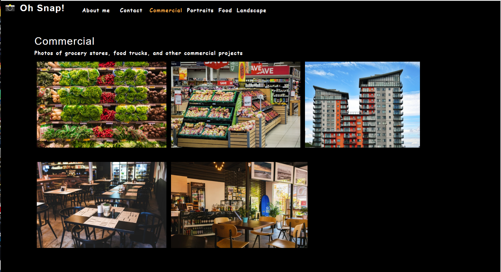

# photo-port   

Example photo-portfolio project done as a hands-on introduction to React.JS

## Table of Contents
* [Description](#description)
* [Installation](#installation)
* [Usage](#usage)
* [License](#license)
* [References](#reference)
* [Tests](#tests)
* [Questions](#questions)

## Description 
_***Built With:***_ JavaScript,CSS,ES6,Node,React,Jest  
This project was all about introducing myself to the basics of React.js. It is a front end only application. I used the create-react-app program to begin the project, then introduced my own components and uploaded photo's. It conditionally renders different photo's and categories of photo's using modal's and remains a single page application. The contact form is set up, but not currently connected to any back end to actually recieve the contact information. This was an excellent learning project that I can use as a reference going forward with exploring more react functionality.

## Installation 
Within Node, use the command 'npx create-react-app' to set up a skeleton of a basic react project for yourself. To see this app deployed click the link below.

[photo-port Deployed App](https://steadysamwise4.github.io/photo-port/)

## Usage 
See above.

## License 
[MIT](./LICENSE)

## References 
2U online bootcamp through University of Kansas

## Tests 
Unit testing via Jest - will definitely be a great resource in the future when I want to dive further into this testing framework.

## Questions 
Contact: Sam Davenport  
https://github.com/steadysamwise4  
davenportsam44@gmail.com
    

